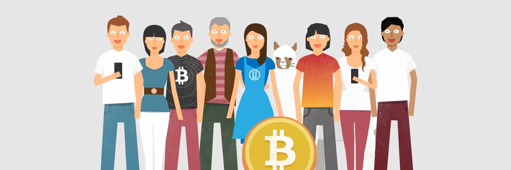

<h1 align="center">Hi 👋, I'm Shebin John</h1>
<h3 align="center">A Learner for life!</h3>

- 🥷 Smart Contract Developer & Security Auditor | Solidity & CAIRO

- 🔭 Current: [Safe](https://safe.global/), Ex **[Nethermind](https://nethermind.io/), [Dynamite Arts](https://dynamitearts.com/), [Kleros](https://kleros.io/), [Sovryn](https://sovryn.com/) and [Origins](https://github.com/Sovryn-Origins)**

- 🌱 I’m currently learning **Blockchain, Smart Contract, Auditing, Cryptography, etc.**

- 👯 I’m looking to advise and guide on **Blockchain projects**

- 👨‍💻 All of my projects are available at [remedcu.com](https://remedcu.com)

- 💬 Ask me about **Solidity, CAIRO, Tokenomics, etc.**

- 📫 How to reach me **admin@remedcu.com**

- 📄 Know about my experiences [shebinjohn.com](shebinjohn.com)

<h3 align="left">Connect with me:</h3>

	
	
	

